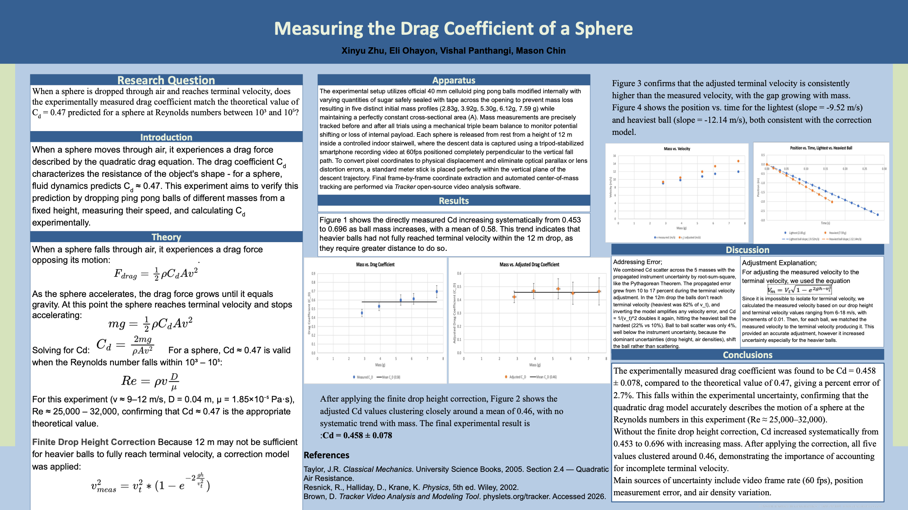
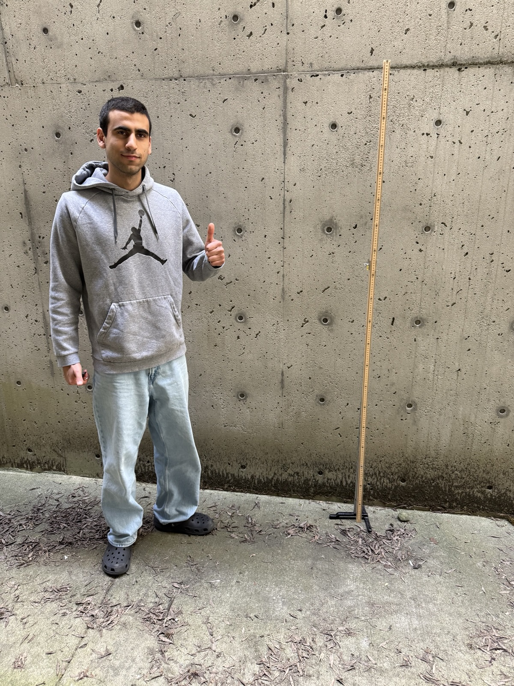
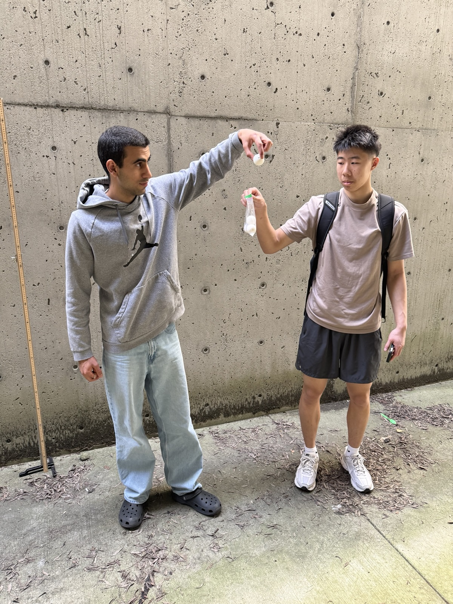

# Measuring the Drag Coefficient of a Sphere

We dropped ping pong balls of different masses down 4 floors (12 meters) of the protected side of a parking garage, filmed them falling, and measured how much air resistance slows a sphere. Our measured drag coefficient, **0.458 ± 0.078**, is within 3 % of the textbook value of 0.47.

**Bellevue College · PHY 123 (Physics 3) · Spring 2026**
Xinyu Zhu, Eli Ohayon, Vishal Panthangi, Mason Chin

*Click the poster to open the full-resolution PDF.*

## The setup

  
  &nbsp;
  

*Left: Me with the setup. Right: Me and Mason with the sugar-filled balls.*

## What's in this repository

The project took two attempts, and the folders follow that order.

**[`01-first-attempt/`](01-first-attempt)**: our first run gave inconsistent results.
- `raw-data/`: raw video-tracking data from five trials
- `average-speed-analysis.xlsx`: our first analysis of that data
- `data-quality-report.pdf`: what went wrong and how we fixed it

**[`02-final-experiment/`](02-final-experiment)**: the redesigned experiment, with lighter balls and a steadier camera setup.
- `drag-coefficient-analysis.xlsx`: final data, calculations and charts
- `poster.pdf`: the research poster shown above
